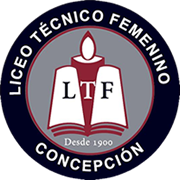
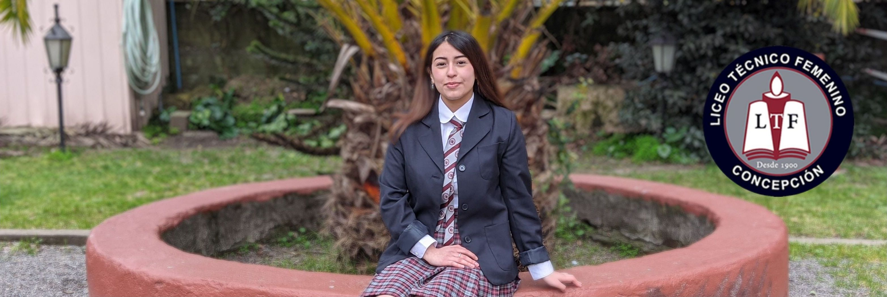
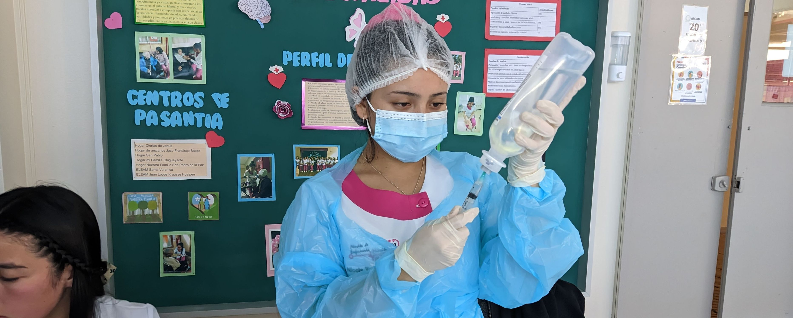
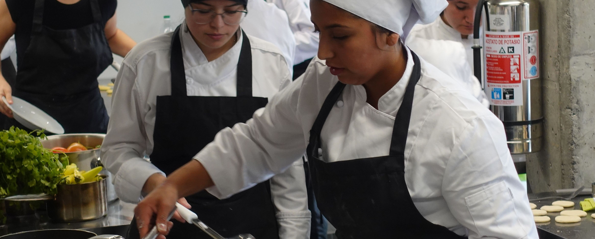
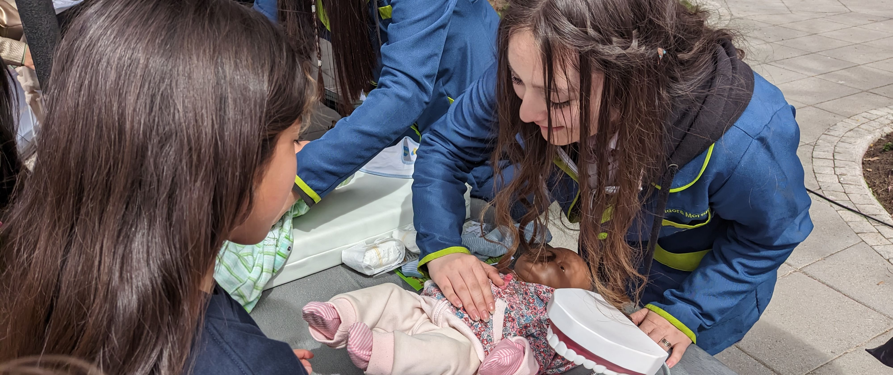

### Proyecto Landing de Negocio "Página Web Liceo Técnico Femenino de Concepción"


# Jorge Rodríguez


Este es el repositorio oficial del sitio web del Liceo Técnico Femenino de Concepción creado por Jorge Rodríguez Gutiérrez.


**Tabla de contenidos**

[TOCM]

[TOC]

#Descripción

El Liceo Técnico Femenino es una institución educativa dedicada a proporcionar una formación integral a sus estudiantes, ofreciendo una variedad de especialidades técnicas y promoviendo una convivencia escolar saludable. Esta página busca competir en el mercado de los liceos técnico ofreciendo las distintas especialidades con el fin de captar la mayor cantidad de alumnado en la provincia de Concepción y sus alrededores.


#Tecnologías Utilizadas

- HTML
- CSS (Bootstrap)

#Instalación

Debes tener instalado el programa [Visual Studio Code](https://code.visualstudio.com/download "Visual Studio Code").

También puedes utilizar [Boostrap](https://getbootstrap.com/ "Boostrap") para modificar o agregar nuevas modificaciones.

#Prototipo simple


#Funcionalidades Principales

- Navegación intuitiva a través de un menú desplegable.
- Sección de noticias con videos incrustados de YouTube.
- Carrusel de imágenes con enlaces a las especialidades ofrecidas por el liceo.
- Información de contacto y enlaces a redes sociales.

####Navegación intuitiva a través de un menú desplegable.

Sistema de navegación en el cual consta de un menu desplagable que contiene todas las entradas necesarias que la pagina requiere de acuerdo a sus necesidades para la navegación. Esta debe ser amigable para todo tipo de usuario para acceder a la información. Además, esta se mantiene fija en la parte superior para acceder en cualquier comento al apartado que se necesite.
####Sección de noticias con videos incrustados de YouTube.
Esta sección denoticias cuenta con información detallada de las actividades mas recientes que han ocurrido en el liceo y busca mantener a la comunidad educativa al tanto de las actividades realizadas con un video que muestra y deja en evidencia el tipo de actividad que se desarrolló.
####Carrusel de imágenes con enlaces a las especialidades ofrecidas por el liceo.
Este carrusel busca informar sobre el o los productos que el liceo ofrece a la comunidad de acuerdo a las necesidades del mercado y entregando una educación de calidad a la altura de institutos superiores y otros centros educativos.
####Información de contacto y enlaces a redes sociales.
En el pie de página podemos encontrar todos los enlaces mas importantes para navegar por la página agregando otros que tambien son de interes, información de contacto y nuestras resdes sociales.


#CSS

```javascript
*{
    margin: 0;
    padding: 0;
    box-sizing: border-box;
    font-family: 'Open Sans';
    text-decoration: none;
    list-style-type: none;

}

body{
    background-color: rgb(110, 14, 27);   
}

img {
    max-width: 100%;
    margin: auto;
    margin-top:0px;
    margin-bottom: 5px;
    justify-content:center;
    display:flex;
}

.fmda {
    width: 100px;
    position:absolute;
    display:flex;
    margin-top: 20px;
    margin-bottom: 20px;
}
/*Barra de Navegación*/
.navbar {
    margin-top: 0;
}

.logo {
    background-color:  #b49599;
}
.container-fluid {
    background-color:  #b49599;
    font-size: 17px;
}
.navbar-brand {
    background-color:  #b49599;
    font-size: 17px;
    margin-top: 0;
}
.dropdown:hover {
    background-color:  #4b262b;
    font-size: 17px;
}
.dropdown-menu {
    background-color:  #b49599;
    font-size: 17px;
}
.dropdown-item:hover {
    background-color: #864d54;
    transition: .3s all;
}
.dropdown-item {
    background-color:  #b49599;
    font-size: 17px;
}
.nav-link {
    background-color:  #b49599;
}
.nav-link:hover {
    background-color:  #864d54;
}

.title {
    font-size: 24px;
    margin-top: 30x;
    margin-bottom: 40px;
}
.title2 {
    color: rgb(241, 231, 231);
}

.especialidad {
    color: rgb(241, 231, 231);
    border:2px;
    font-size: 30px;
    text-decoration: none;   
    transition: all .5s ease;
    height: 80px;
}

.especialidad:hover {
    color: #3b1212c7;
    transition: .3s all;
}

/*noticias*/
.news {
    background-color: rgb(231, 155, 151);
    border-radius: 5px;
    margin-top: 5;
    margin-left: 5px;
    margin-right: 5px;
    max-width: auto;
    text-align: center;
}

.slider {
    text-align: justify;
    width: 100%;
    overflow: hidden;
    
}

.sub {
    text-align: center;
}
.parrafo-track {
    text-align: justify;
    display: flex;
    border: 2px; 
}
.parrafo {
    margin-left: 3px;
    margin-right: 3px;
}

/*footer*/
.container {
    max-width: 1200;
    margin: 0;
}
.footer {
    background-color: rgb(43, 4, 11);
    padding: 80px 0;
}
.footer-row {
    display: flex;
    flex-wrap: wrap;
}
.footer-links {
    width: 20%;
    padding: 0 2px;
}
.footer-links h4 {
    margin-left: 30px;
    font-size: 16px;
    color:aliceblue;
    margin-bottom: 15px;
    font-weight: 500;
    border-bottom: 2px solid #b49599;
    padding-bottom: 8px;
    display: inline-block;
}
.footer-links ul li a {
    font-size: 18px;
    text-decoration: none;
    color: rgb(255, 240, 242);
    display: block;
    margin-bottom: 15px;
    transition: all .3s ease;
    list-style-type: none;
}
.footer-links ul li a:hover {
    color: rgb(194, 28, 42);
    padding-left: 2px;

}
.social-links a {
    display:inline-block;
    min-height: 40px;
    width: 40px;
    background-color: rgb(233, 122, 137);
    margin: 0 10px 10px 0;
    text-align: center;
    line-height: 40px;
    border-radius: 50%;
    color: white;
    transition: all .5s ease;
}
.social-links a:hover {
    background-color: rgb(179, 8, 31);
}

.icon {
    position:absolute;
    margin: 2px 0px 2px;
}
/*Responsive para dispositivos mobiles*/
@media(max-width:400px) {
    .footer-row {
        text-align: center;
    }

    .footer-links {
        width: 100%;
        margin-bottom:30px;
    }
}
@media only screen and (max-width: 400px) {
    /* Agrega estilos específicos para dispositivos móviles aquí */
    .menu-horizontal {
        flex-direction: column;
        align-items: center;
    }
    .menu-horizontal > li {
        margin-bottom: 10px;
    }
}
```

#HTML code

```html
<!DOCTYPE html>
<html lang="es">
<head>
    <meta charset="UTF-8">
    <meta name="viewport" content="width=device-width, initial-scale=1.0">
    <link href="https://cdn.jsdelivr.net/npm/bootstrap@5.3.3/dist/css/bootstrap.min.css" rel="stylesheet">
    <link href="https://getbootstrap.com/docs/5.3/assets/css/docs.css" rel="stylesheet">
    <link rel="stylesheet" href="https://cdnjs.cloudflare.com/ajax/libs/font-awesome/6.5.2/css/all.min.css">
    <title>Liceo Técnico Femenino</title>
    <link rel="stylesheet" href="estilos.css">
    <script src="https://cdn.jsdelivr.net/npm/bootstrap@5.3.3/dist/js/bootstrap.bundle.min.js"></script>   
</head>
<body>
    <nav class="navbar navbar-expand-lg fixed-top">
        <div class="container-fluid">
          <a class="navbar-brand" href="./boostrap.html"></a>
          <button class="navbar-toggler" type="button" data-bs-toggle="collapse" data-bs-target="#navbarNavDropdown" aria-controls="navbarNavDropdown" aria-expanded="false" aria-label="Toggle navigation">
            <span class="navbar-toggler-icon"></span>
          </button>
          <div class="collapse navbar-collapse" id="navbarNavDropdown">
            <ul class="navbar-nav">
              <li class="nav-item">
                <a class="nav-link active" aria-current="page" href="#">Inicio</a>
              </li>
              <li class="nav-item dropdown">
                <a class="nav-link dropdown-toggle" href="#" role="button" data-bs-toggle="dropdown" aria-expanded="false">
                  Nuestro Liceo
                </a>
                <ul class="dropdown-menu">
                  <li><a class="dropdown-item" href="#">Misión Visión y Sellos</a></li>
                  <li><a class="dropdown-item" href="#">Documentos Institucionales</a></li>
                  <li><a class="dropdown-item" href="#">Himno</a></li>
                  <li><a class="dropdown-item" href="#">Nuestra Historia</a></li>
                  <li><a class="dropdown-item" href="#">Quienes Somos</a></li>
                </ul>
              </li>
              <li class="nav-item dropdown">
                <a class="nav-link dropdown-toggle" href="#" role="button" data-bs-toggle="dropdown" aria-expanded="false">
                  Formación General
                </a>
                <ul class="dropdown-menu">
                  <li><a class="dropdown-item" href="#">Asignaturas</a></li>
                  <li><a class="dropdown-item" href="#">ABP</a></li>
                </ul>
              </li>
              <li class="nav-item dropdown">
                <a class="nav-link dropdown-toggle" href="#" role="button" data-bs-toggle="dropdown" aria-expanded="false">
                  Especialidades
                </a>
                <ul class="dropdown-menu">
                  <li><a class="dropdown-item" href="#">Enfermería</a></li>
                  <li><a class="dropdown-item" href="#">Gastronomía</a></li>
                  <li><a class="dropdown-item" href="#">Atención de Párvulos</a></li>
                  <li><a class="dropdown-item" href="#">Programación</a></li>
                </ul>
              </li>
              <li class="nav-item">
                <a class="nav-link" href="#">Convivencia Escolar</a>
              </li>
              <li class="nav-item">
                <a class="nav-link" href="#">Pastoral</a>
              </li>
              <li class="nav-item">
                <a class="nav-link" href="https://www.appoderado.cl" target="_blank">Appoderado.cl</a>
              </li>
            </ul>
          </div>
        </div>
      </nav>
      
      <main>
        <section>
            <article class="news">
              <div>
                  <h1><b><u><p class="title">Noticias relacionadas con las ultimas actividades realizadas en nuestro liceo</p></u></b></h1>
                  <div>
                      <div class="parrafo-track">
                          <div class="">
                            <iframe width="560" height="315" src="https://www.youtube.com/embed/EvD1Onqf4Yo?si=Wl2VnJI9Kl2vSKdm" title="YouTube video player" frameborder="0" allow="accelerometer; autoplay; clipboard-write; encrypted-media; gyroscope; picture-in-picture; web-share" referrerpolicy="strict-origin-when-cross-origin" allowfullscreen></iframe>
                          </div>
                          <div class="parrafo">
                              
                          </div>
                          <div class="parrafo">
                              
                          </div>
                          <div class="parrafo">
                            
                          </div>
                          <div class="parrafo">
                            <h3 class="sub">Conmemoración Día del Trabajador </h3>El Liceo Técnico Femenino de Concepción conmemoró el Día del Trabajo el lunes 6 de mayo con un acto especial que reunió a estudiantes, docentes, asistentes de la educación y contó con la destacada participación de la SEREMI del Trabajo y Previsión Social del Biobío, la Sra. Sandra Quintana. 
                          </div>
                          <div class="parrafo">
                            En este emotivo evento, los cuartos medios fueron el foco principal, ya que se acerca el momento de su graduación. La presencia de la SEREMI añadió un valor significativo, ya que entregó un mensaje inspirador a las estudiantes que están a punto de egresar, brindándoles orientación y motivación para su futuro laboral.  
                          </div>
                          <div class="parrafo">
                            El acto del Día del Trabajo fue una oportunidad para reconocer la importancia del trabajo digno y la contribución de cada individuo al desarrollo de la sociedad. Además, resaltó el compromiso del Liceo Técnico Femenino de Concepción en la formación integral de sus estudiantes, preparándolas para enfrentar con éxito los desafíos del mundo laboral.  
                          </div>
                      </div>
                  </div>
    
                  <div class="parrafo-track">
                    <div class="parrafo">
                        <h3 class="sub">Todos somos Convivencia.</h3> En el marco de la celebración de la semana de la Convivencia Escolar, el equipo de Conviencia Escolar del Liceo Técnico Femenino de Concepción organizó una actividad de feria de la sana convivencia escolar "Todos al Patio", con el objetivo de promover una convivencia escolar saludable y armoniosa entre todos los miembros de la comunidad educativa.
                    </div>
                    <div class="parrafo">
                        Durante esta iniciativa, se llevó a cabo una feria de sana convivencia escolar en la que se ofrecieron juegos individuales y grupales, con premios para incentivar la participación de profesores, asistentes a la educación y estudiantes. El ambiente festivo y participativo permitió que todos pudieran compartir en el patio, fortaleciendo los lazos y el sentido de pertenencia dentro del colegio.
                    </div>
                    <div class="parrafo">
                        Además, las niñas de cuarto año tuvieron la oportunidad de realizar ventas para recaudar fondos, lo que no solo contribuyó a la actividad, sino que también les brindó una experiencia en emprendimiento y trabajo en equipo.
                    </div>
                    <div class="parrafo">
                        El enfoque principal de la actividad fue promover la importancia de la convivencia escolar y brindar información sobre qué es y cómo fomentarla. Se entregó material informativo sobre los protocolos y la tipificación de faltas relacionadas con la convivencia escolar, invitando a todos los miembros de la comunidad educativa a sumarse a una convivencia escolar positiva y respetuosa.
                    </div>
                    <div class="parrafo">
                     
                    </div>
                    <div class="parrafo">
                       
                    </div>
                    <div class="">
                        <iframe width="560" height="315" src="https://www.youtube.com/embed/Kty2Nst-qEE?si=UT_qFR_fJz48yyuM" title="YouTube video player" frameborder="0" allow="accelerometer; autoplay; clipboard-write; encrypted-media; gyroscope; picture-in-picture; web-share" referrerpolicy="strict-origin-when-cross-origin" allowfullscreen></iframe>
                    </div>
                </div>
              </div>
           </article> 
          </section>
         <div class="title2"><h3><b><center>Nuestras Especialidades</center></b></h3></div>
        <div id="carouselExampleInterval" class="carousel slide" data-bs-ride="carousel">
            <div class="carousel-inner">
              <div class="carousel-item active" data-bs-interval="5000">
                
                <div class="carousel-caption d-none d-md-block">
                    <h1><B><a class="especialidad" href="./enfermeria.html">Especialidad de Enfermería Mención Adulto Mayor</a></B></h1>
                </div>
              </div>
              <div class="carousel-item" data-bs-interval="5000">
                
                <div class="carousel-caption d-none d-md-block">
                    <h1><B><a class="especialidad" href="./gastronomia.html">Especialidad de Gastronomía Mención Cocina, Mención Pastelería y Repostería</a></B></h1>
                </div>
               </div>
              <div class="carousel-item" data-bs-interval="5000">
                
                <div class="carousel-caption d-none d-md-block">
                    <h1><B><a class="especialidad" href="./parvulo.html">Especialidad de Atención de Párvulos</a></B></h1>
                </div>
               </div>
              <div class="carousel-item" data-bs-interval="5000">
                
                <div class="carousel-caption d-none d-md-block">
                    <h1><B><a class="especialidad" href="./programacion.html">Especialidad de Atención de Programación. PRÓXIMAMENTE</a></B></h1>
                </div>
            </div>
            <button class="carousel-control-prev" type="button" data-bs-target="#carouselExampleInterval" data-bs-slide="prev">
              <span class="carousel-control-prev-icon" aria-hidden="true"></span>
              <span class="visually-hidden">Previous</span>
            </button>
            <button class="carousel-control-next" type="button" data-bs-target="#carouselExampleInterval" data-bs-slide="next">
              <span class="carousel-control-next-icon" aria-hidden="true"></span>
              <span class="visually-hidden">Next</span>
            </button>
          </div>
     </main>
      <footer class="footer">
        <div class="footer-row">
            <div class="footer-links">
                <h4>Establecimiento</h4>
                <ul>
                    <li><a href="#">Nosotros</a></li>
                    <li><a href="#">Proyecto educativo</a></li>
                    <li><a href="#">Nuestros docentes</a></li>
                    <li><a href="#">Talleres ACLE</a></li>
                </ul>
            </div>
            <div class="footer-links">
                <h4>Especialidades</h4>
                <ul>
                    <li><a href="#">Enfermería</a></li>
                    <li><a href="#">Gastronomía</a></li>
                    <li><a href="#">Atención de Párvulos</a></li>
                    <li><a href="#">Programación</a></li>
                </ul>
            </div>
            <div class="footer-links">
                <h4>Ayuda</h4>
                <ul>
                    <li><a href="#">Preguntas frecuentes</a></li>
                    <li><a href="#">Trabaja con nosotros</a></li>
                    <li><a href="#">Bolsa de trabajo</a></li>
                    <li><a href="#">Sugerencias</a></li>
                </ul>
            </div>
            <div class="footer-links">
                <h4>Contacto</h4>
                <ul>
                    <li><a href="tel:+412221312">&nbsp;&nbsp;&nbsp;&nbsp;Inspectoría: 41-2221312</a></li>
                    <li><a href="tel:+412234475">&nbsp;&nbsp;&nbsp;&nbsp;Secretaría: 41-2234475</a></li>
                    <li><a href="mailto:secretariadireccion@liceotecnicofemenino.cl">&nbsp;&nbsp;&nbsp;&nbsp;secretariadireccion@liceotecnicofemenino.cl</a></li>
                    <li><a href="https://maps.app.goo.gl/qxt6UQSdakXLkfjSA" target="_blank">&nbsp;&nbsp;&nbsp;Victor Lamas 567, Concepción</a></li>
                </ul>
            </div>
            <div class="footer-links">
                <h4>Siguenos</h4>
                <div class="social-links">
                    <a href="https://www.facebook.com/ltfconcepcion" target="_blank"><i class="fab fa-facebook-f"></i></a>
                    <a href="https://www.instagram.com/liceotecfem" target="_blank"><i class="fab fa-instagram"></i></a>
                    <a href="tel:+56931993221"><i class="fab fa-whatsapp"></i></a>
                    <a href="https://youtube.com/@liceotecnicofemeninodeconc5751?si=TmGlpetwoVVdiiXK" target="_blank"><i class="fab fa-youtube"></i></a>                   
                </div> 
            </div>
        </div>
        <a href="http://www.fmda.cl/" target="_blank"></a>
       </footer>
</body>
</html>
```

###Imagenes


